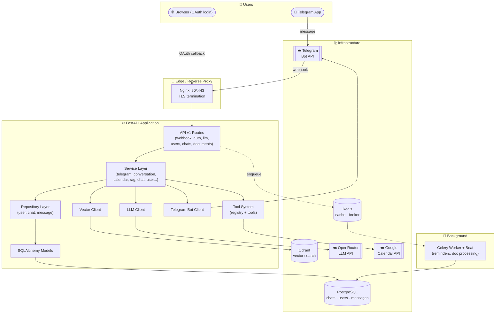
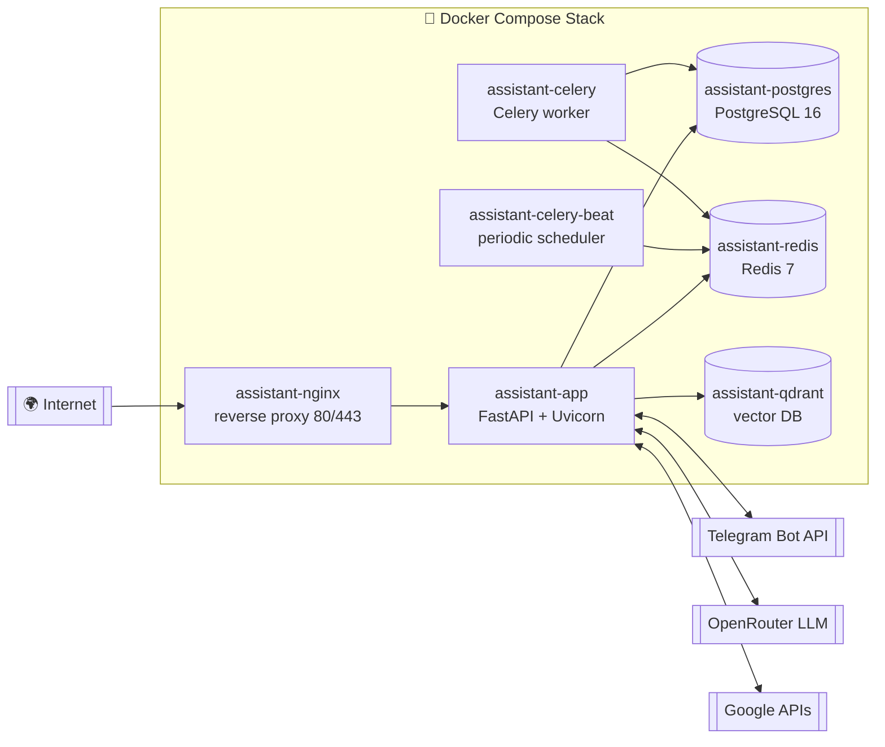
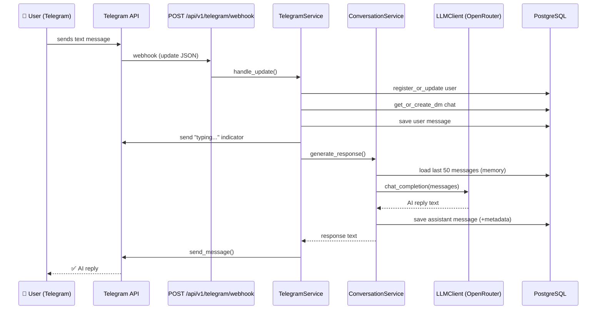
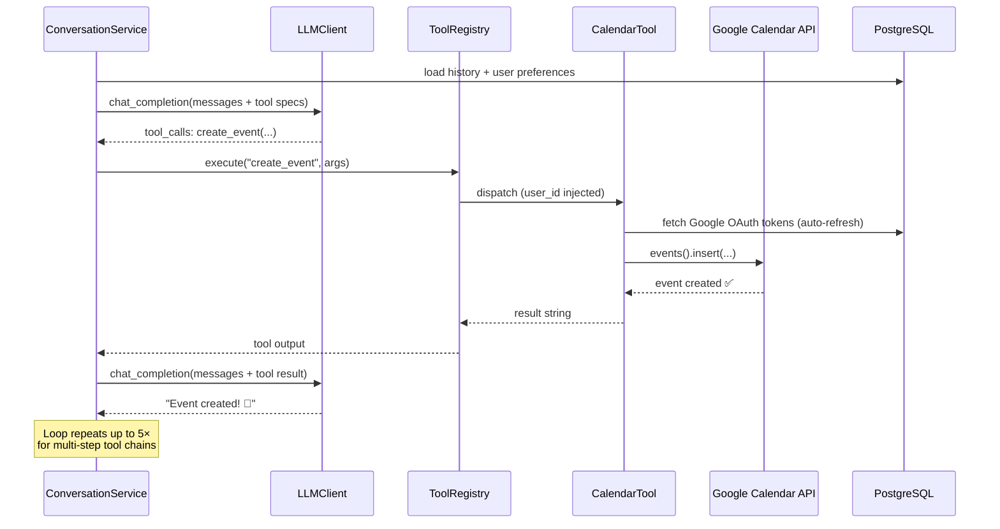
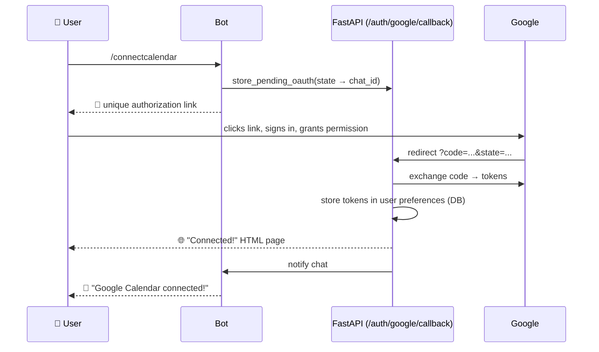
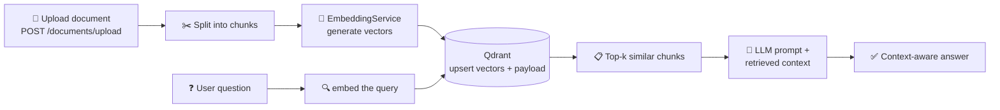
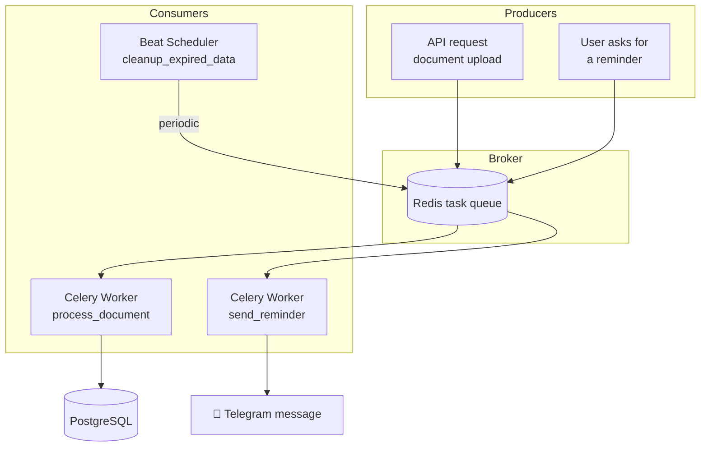
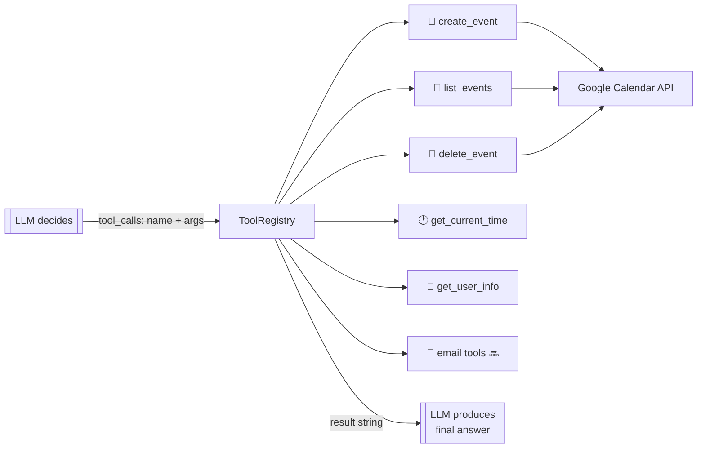
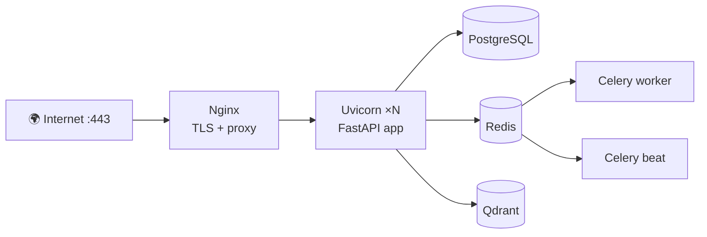
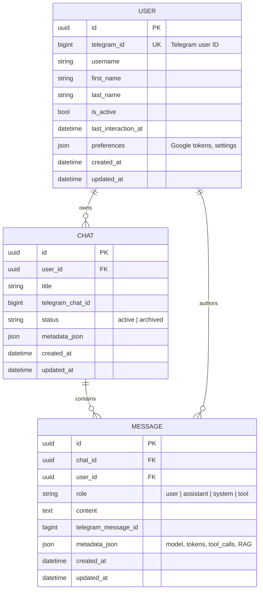

# 📘 System Overview — AI Personal Assistant

> A visual guide to **how the system works** — from a Telegram message to an AI answer with real-world actions.
> For layer rules and file-by-file code details, see [ARCHITECTURE.md](ARCHITECTURE.md).
> For setup and deployment, see [README.md](README.md) and [DEPLOYMENT.md](DEPLOYMENT.md).

---

## Table of Contents

1. [What This System Does](#1-what-this-system-does)
2. [High-Level System Diagram](#2-high-level-system-diagram)
3. [Component Map (Container View)](#3-component-map-container-view)
4. [How the System Works — End-to-End Flows](#4-how-the-system-works--end-to-end-flows)
5. [Section-by-Section Details](#5-section-by-section-details)
6. [Data Model Overview](#6-data-model-overview)
7. [Tech Stack Summary](#7-tech-stack-summary)

---

## 1. What This System Does

The **AI Personal Assistant** is a multi-user Telegram chatbot that:

- 💬 **Chats naturally** — every message goes through an LLM (via OpenRouter)
- 🧠 **Remembers users** — chats, messages, and preferences are stored in PostgreSQL
- 📅 **Takes real actions** — creates/lists/deletes Google Calendar events via LLM tool calling + OAuth 2.0
- 📄 **Understands documents** — uploads are embedded and searchable (RAG with Qdrant)
- ⏰ **Works in the background** — reminders and document processing run on Celery workers

> **One sentence:** User talks on Telegram → system thinks with an LLM → LLM calls tools (Calendar, etc.) if needed → answer is stored and sent back.

---

## 2. High-Level System Diagram

**Reading the diagram:**

| Arrow                                | Meaning                                                                    |
| ------------------------------------ | -------------------------------------------------------------------------- |
| Telegram → Nginx → API               | Incoming messages arrive as HTTPS webhooks (or polling in dev)             |
| API → Services → Tools               | Routes are thin; business logic lives in services; LLM can invoke tools    |
| Services → Repositories → PostgreSQL | All persistence goes through the repository pattern                        |
| LLM Client → OpenRouter              | Model inference is a separate HTTP client (swappable provider)             |
| Redis ⤳ Celery                       | Heavy work (documents, reminders) runs asynchronously off the request path |

---

## 3. Component Map (Container View)

**Containers and their jobs:**

| Container               | Role                                                             |
| ----------------------- | ---------------------------------------------------------------- |
| `assistant-app`         | FastAPI app: webhook, REST API, OAuth callback, tool calling     |
| `assistant-celery`      | Executes background tasks (reminders, async document processing) |
| `assistant-celery-beat` | Schedules periodic tasks (cleanup, housekeeping)                 |
| `assistant-postgres`    | Primary datastore: users, chats, messages, preferences           |
| `assistant-redis`       | Cache + Celery broker/backend                                    |
| `assistant-qdrant`      | Vector database for RAG document search                          |
| `assistant-nginx`       | TLS termination (Let's Encrypt), routes traffic to the app       |

> **Dev mode (`run_dev.py`)** runs only the app with SQLite + polling, and Redis/Qdrant gracefully degrade — no Docker required.

---

## 4. How the System Works — End-to-End Flows

### 4.1 Flow 1 — A Normal Chat Message

> User: _"Hey, what can you do?"_

**Key point:** the LLM is **stateless** — the system reconstructs memory by loading the last 50 stored messages from PostgreSQL into the prompt on every request.

### 4.2 Flow 2 — Tool Calling (Google Calendar Action)

> User: _"Create a meeting tomorrow at 3pm"_

**Key point:** the LLM never talks to Google directly — it emits a **structured tool call** (`name + JSON arguments`), and the Tool System executes it safely with the user's stored OAuth credentials.

### 4.3 Flow 3 — Google OAuth 2.0 Connect

> User sends `/connectcalendar`

**Key point:** fully **web-based OAuth** — no copy-paste codes. The `state` parameter maps the browser session back to the correct Telegram chat.

### 4.4 Flow 4 — RAG (Document Upload & Q&A)

> User uploads a PDF via the API, then asks _"What does my contract say about deadlines?"_

**Key point:** the LLM only ever sees the **relevant slices** of a document, not the whole file — this keeps prompts small and answers accurate.

### 4.5 Flow 5 — Background Jobs (Celery)

**Key point:** slow or scheduled work is pushed to workers so the API stays fast.

---

## 5. Section-by-Section Details

### 5.1 🤖 Telegram Interface (`app/bot/`)

The bridge between Telegram and our backend.

| Component            | Responsibility                                                 |
| -------------------- | -------------------------------------------------------------- |
| `TelegramBotClient`  | `send_message()`, `send_typing()`, webhook register/delete/get |
| Polling (dev)        | `run_dev.py` long-polls `getUpdates` — no public URL needed    |
| Webhook (production) | Telegram pushes HTTPS updates to `/api/v1/telegram/webhook`    |

### 5.2 🌐 API Layer (`app/api/v1/`)

Thin HTTP handlers — **no business logic**. Parse → validate → delegate → respond.

| Endpoint                           | Handler        | What it does                           |
| ---------------------------------- | -------------- | -------------------------------------- |
| `POST /api/v1/telegram/webhook`    | `telegram.py`  | Ingest Telegram updates                |
| `GET /api/v1/auth/google/callback` | `auth.py`      | Finish Google OAuth, store tokens      |
| `POST /api/v1/llm/chat`            | `llm.py`       | Direct LLM chat (future web dashboard) |
| `POST /api/v1/documents/upload`    | `documents.py` | Upload docs for RAG                    |
| `POST /api/v1/documents/query`     | `documents.py` | Query docs (vector search + LLM)       |
| `GET /api/v1/users/me`             | `users.py`     | Current user info                      |
| `GET /api/v1/chats`                | `chats.py`     | List chats / messages                  |
| `GET /api/v1/health`               | `router.py`    | Health check                           |

### 5.3 🧩 Service Layer (`app/services/`)

The **brain** of the system — all orchestration and business rules.

| Service                            | Responsibility                                                         |
| ---------------------------------- | ---------------------------------------------------------------------- |
| `TelegramService`                  | Update pipeline: register user → load prefs → save msg → reply         |
| `ConversationService`              | LLM loop: history → system prompt → RAG context → tools → final answer |
| `ChatService`                      | Chat/message CRUD, history for LLM context                             |
| `UserService`                      | Registration + preferences (incl. Google tokens)                       |
| `GoogleCalendarService`            | OAuth flow, token refresh, event create/list/delete                    |
| `RAGService`                       | Chunk, embed, store, retrieve, format document context                 |
| `EmbeddingService`                 | Text → vectors                                                         |
| `TaskPlannerService`               | Decomposes complex requests into multi-step plans                      |
| `CalendarService` / `EmailService` | Abstractions for tool system / future Gmail integration                |

### 5.4 🛠️ Tool System (`app/tools/`) — LLM Function Calling

An extensible plugin registry that lets the LLM **act**, not just talk.

- Every tool extends `BaseTool` (`name`, `description`, JSON-Schema `parameters`, async `execute()`)
- `loader.py` auto-registers all tools at startup
- Registry emits **OpenAI-compatible tool specs** to the LLM
- User identity is injected into tool args — tools look up per-user OAuth tokens

### 5.5 🧠 LLM Client (`app/llm/`)

| Capability    | Detail                                                        |
| ------------- | ------------------------------------------------------------- |
| Provider      | OpenRouter (default model: `deepseek/deepseek-v4-flash-0731`) |
| Methods       | `chat_completion()`, `chat_completion_stream()`               |
| Transport     | `httpx.AsyncClient`, 60s timeout, streaming support           |
| Why isolated? | Swap LLM providers by editing **one file** only               |

### 5.6 💾 Data Layer (`app/models/`, `app/repositories/`)

**Models** define the schema; **repositories** are the only code that touches the DB.

- `BaseRepository` — generic `create / get / get_all / update / delete`
- `UserRepository` — `get_by_telegram_id()`
- `ChatRepository` — `get_by_user()`, `get_or_create_dm()`
- `MessageRepository` — `get_chat_history()` (feeds LLM memory)

Benefits: mockable in tests, swappable ORM, no scattered SQL.

### 5.7 🔎 Vector Search & RAG (`app/vector/`, embedding + rag services)

| Component         | Role                                                                        |
| ----------------- | --------------------------------------------------------------------------- |
| `VectorClient`    | Qdrant `upsert_document()`, `search_similar()`, `delete_document()`         |
| Graceful fallback | If Qdrant is absent (dev mode), operations log a warning and skip           |
| Pipeline          | chunk → embed → store → query-time: embed question → top-k → prompt context |

### 5.8 ⚡ Cache & Messaging (`app/core/redis.py`)

Redis is used for: hot data caching, Celery broker/result backend, and session-style state.
Like Qdrant, it **degrades gracefully** when not configured.

### 5.9 🔧 Background Workers (`app/worker.py`)

| Task                     | Trigger              | Purpose                          |
| ------------------------ | -------------------- | -------------------------------- |
| `send_reminder()`        | user request / time  | Push scheduled Telegram messages |
| `process_document()`     | document upload      | Offload heavy RAG ingestion      |
| `cleanup_expired_data()` | Celery Beat schedule | Housekeeping                     |

### 5.10 ⚙️ Core Infrastructure (`app/core/`)

| File              | Responsibility                                               |
| ----------------- | ------------------------------------------------------------ |
| `config.py`       | Pydantic Settings — all env vars in one typed object         |
| `database.py`     | Async SQLAlchemy engine (PostgreSQL **or** SQLite), sessions |
| `redis.py`        | Redis singleton connection manager                           |
| `logging.py`      | Centralized colored logging, noisy-lib suppression           |
| `dependencies.py` | DI container (`deps`) providing DB sessions and Redis        |

### 5.11 🚀 Deployment View (`Dockerfile`, `docker-compose.yml`, `nginx/`)

- **Webhook auto-registration:** on startup, if `WEBHOOK_URL` is set, the app registers `{WEBHOOK_URL}/api/v1/telegram/webhook` with Telegram
- **Dev vs Prod, same code:** `run_dev.py` flips `DATABASE_URL` to SQLite, enables polling, disables Redis/Qdrant — no code changes

---

## 6. Data Model Overview

All tables inherit **UUID primary keys** and **`created_at` / `updated_at`** timestamps from the declarative base. Schema changes are versioned with **Alembic** migrations.

---

## 7. Tech Stack Summary

| Concern            | Technology                                          |
| ------------------ | --------------------------------------------------- |
| Language / Runtime | Python 3.10+, asyncio               |
| Web framework      | FastAPI + Uvicorn                                   |
| Validation         | Pydantic v2 (+ pydantic-settings)                   |
| ORM / Migrations   | SQLAlchemy 2 (async) + Alembic                      |
| Databases          | PostgreSQL (prod), SQLite (dev)                     |
| Cache / Broker     | Redis                                               |
| Background jobs    | Celery + Celery Beat                                |
| Vector search      | Qdrant                                              |
| LLM                | OpenRouter API (pluggable models)                   |
| External APIs      | Telegram Bot API, Google OAuth 2.0, Google Calendar |
| Deployment         | Docker, Docker Compose, Nginx, Let's Encrypt        |
| Quality            | Ruff, strict mypy, type hints everywhere            |
| Architecture       | Clean Architecture, SOLID, Repository Pattern, DI   |

---

_Diagrams use [Mermaid](https://mermaid.js.org/) — they render automatically on GitHub, GitLab, and VS Code (with the Mermaid extension)._
